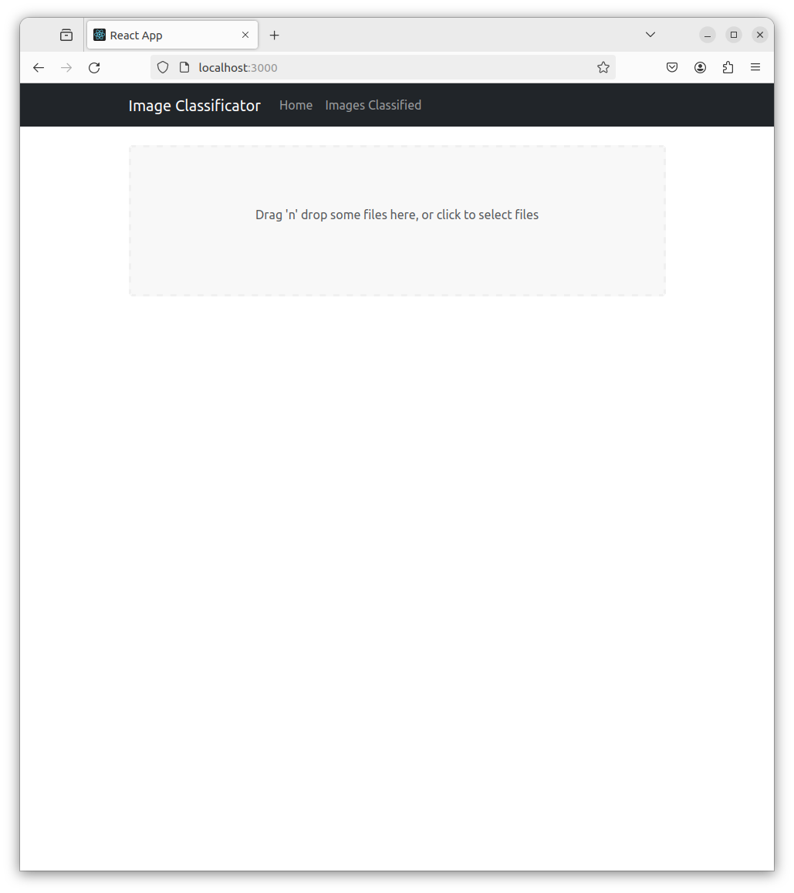
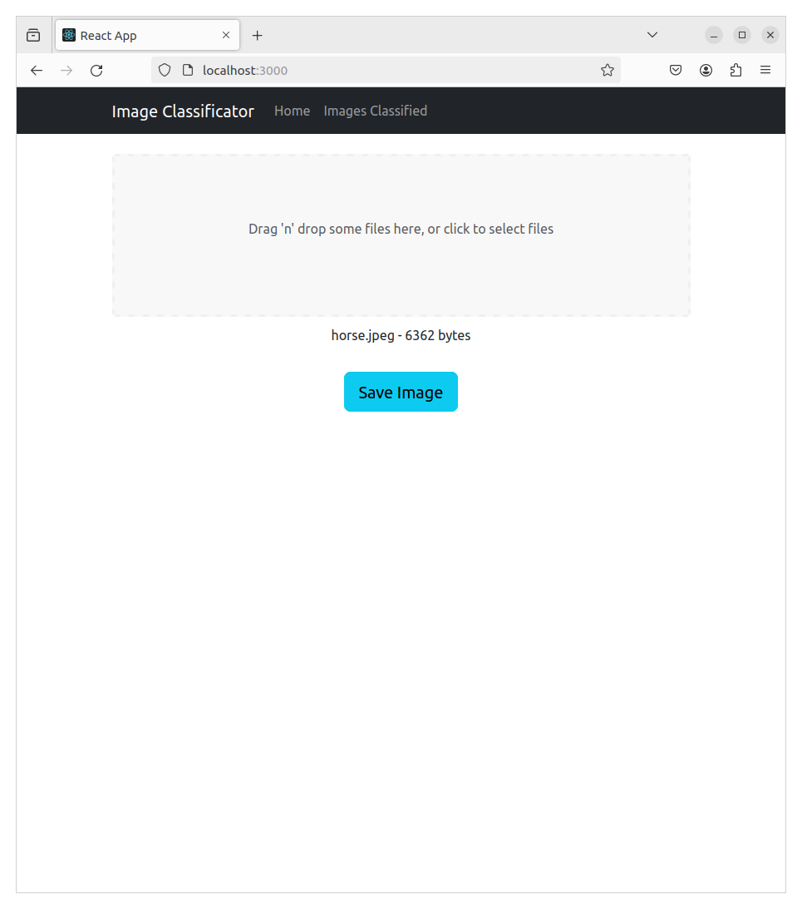
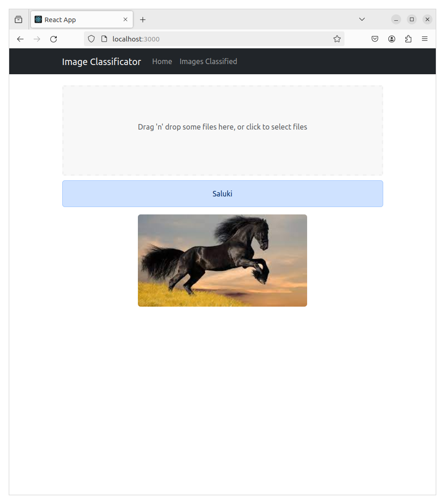
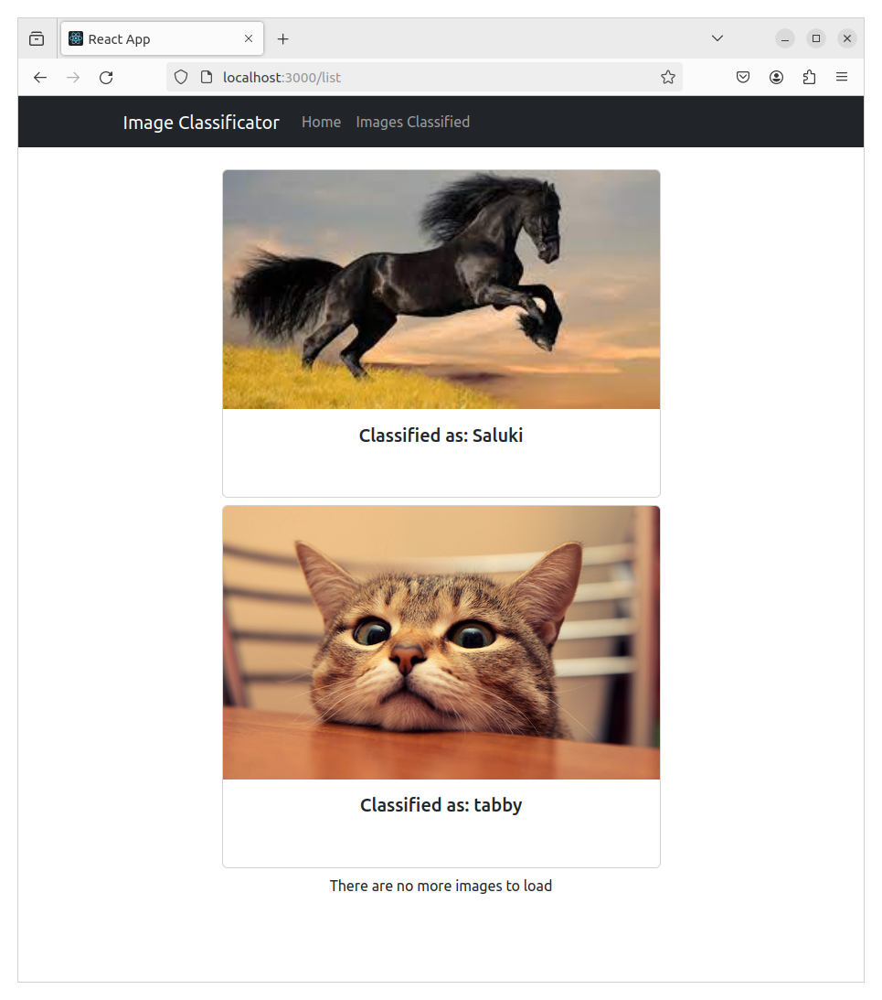

# Proyecto de introducción a REACT para DEW 2DAW

### Javier García Hernández && Nuhazet Correa Torres

## Descripción de la aplicación

Este repositorio recoge un proyecto realizado como introducción al framework para desarrollo web REACT. El proyecto consiste en una aplicación que nos permite clasificar imágenes mediante la consulta a un modelo entrenado para reconocer patrones: <i>InceptionResNetV2</i>. El frontend, realizado en REACT, nos permite interaccionar con el modelo que corre en el backend, realizado en Django. Las imágenes ya clasificadas se almacenan por el backend y podemos ver los resultados de las clasificaciones solicitándolas desde el frontend. 

## Dockerización

Dado que se opta por no realizar el despliegue en producción de la aplicación, se ha "dockerizado" el proyecto para poder probarlo facilmente a partir del código mantenido en el repositorio.

Para lanzar el contenedor basta con posicionarse en la carpeta raíz del proyecto y lanzar el comando:
    
    sudo docker compose up

Una vez levantado el contenedor, tendremos disponible nuestro frontend en:

    http://localhost:3000/

Y nuestro backend (el lado administrador) en:

    http://localhost:8000/admin/

Las credenciales del backend para la base de datos que tenemos en el repositorio son:

    usuario: super
    password: super

## Ejemplo de uso

Una vez estamos en el home de la página nos aparece una zona para arrastrar y soltar ficheros.

Interactuando con dicha zona podemos 'presentarle' la imagen a la aplicación. Una vez tenga la imagen cargada, nos aparecerá un botón para poder solicitar guardarla en la base de datos. Una vez realizada la petición, el backend clasificará la imagen antes de guardarla y, una vez lo haya hecho, comunicará al frontend el resultado, que será mostrado al usuario.

Una vez la imagen ha sido clasificada, podemos navegar hasta la vista 'Images Classified' y ver el listado de imágenes que han sido clasificadas.

## El frontend, REACT

La mayoría de los componentes utilizados se importan de react-bootstrap.

La aplicación consta de componentes de enrutamiento en su fichero App.js, con los que se controla la navegación entre las vistas.

En la carpeta de componentes se definen tres componentes:

1. Navigation

    Un componente construido a partir de un navbar importado.

2. ImageList

    El componente que se emplea para visualizar las imágenes clasificadas en la base de datos. Se emplea otro componente más simple para representar cada una de las imágenes. Se emplean componentes importados: Button y Spinner. El componente Image emplea el componente importado Card.

3. Classifier

    El componente que se emplea para realizar la carga de las imágenes a clasificar y guardarlas en la base de datos. Se emplean componentes importados:
    Button, Spinner y Alert. Mencionar a parte el componente Dropzone, que se importa de su propia librería.
